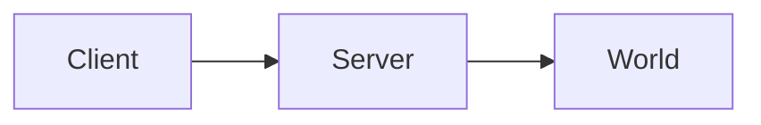

+++
title = "Community Pages"

+++

If you want to add your own page to the reference, please submit a pull request to https://github.com/spacestation13/dm-ref/ under the `static/community/` directory. These should be formatted as `.md` documents.

## Supported Syntax

Quartz supports all the Markdown formatting you would expect. In addition, we also support some special features, including:

### Callouts

Callouts are blockquotes with a type annotation. The type determines the color and icon.

```markdown
> [!note]
> This is a note callout.

> [!warning]
> This is a warning.

> [!tip]
> A helpful tip.

> [!danger]
> Something dangerous.

> [!note] Custom Title
> You can override the title by putting text after the type.
```

> [!note]
> This is a note callout.

> [!warning]
> This is a warning.

> [!tip]
> A helpful tip.

> [!danger]
> Something dangerous.

> [!note] Custom Title
> You can override the title by putting text after the type.

### Code Blocks

Fenced code blocks support syntax highlighting. Use `dream-maker` for DM code:

````markdown
```dream-maker
/proc/hello()
    world << "Hello, world!"
```
````

```dream-maker
/proc/hello()
    world << "Hello, world!"
```

### Highlights

Wrap text in `==` to ==highlight it==.

```markdown
This is ==highlighted text==.
```

### LaTeX Math

Inline math with single dollar signs, display math with double:

```markdown
Inline: $E = mc^2$

Display:

$$
\sum_{i=1}^{n} i = \frac{n(n+1)}{2}
$$
```

Inline: $E = mc^2$

$$
\sum_{i=1}^{n} i = \frac{n(n+1)}{2}
$$

### Mermaid Diagrams

Use `mermaid` code blocks to render diagrams:

````markdown

````


### Escaping Special Characters

Because we support LaTeX math, literal `$` signs in text need to be escaped as `\$`. Similarly, `%%` should be written as `&#37;&#37;` to avoid conflicts with template syntax.
